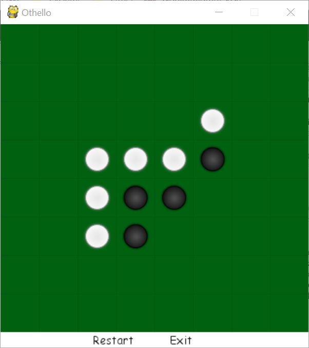

# Othello
Othello Game (also named as reversi) with Computer as the Opponent. 

Refer to https://en.wikipedia.org/wiki/Reversi for game rules.

## Why PyGame ?

PyGame is the most classic SDL library for Game GUI development. Python and SDL is suitable for the development of 2D games. PyGame is at the relatively lower level and you can control most things by yourself. It would be easier for simple display like reversi.

Keep it simple!

## An Screenshot of Game GUI

## Architecture

### Component One: Game Engine - main.py

Game engine handles all I/O events, repaints the board and manages games.

### Component Two: Game Logic Implementation

All game logic will be handled by othello.py.

### Component Three: Artificial Intelligence

Artificial intelligence algorithm will be implemented in this component.

## How to Run?

In Windows,

- Install python 3 (3.6.1 or above)
- Install pygame `py -m pip install pygame`
- Go to the root directory and run `py main.py`

In Linux,

- Check python version: `python3 --version`
- If not installed: `sudo apt-get install python3.6`
- Install pygame: `sudo apt-get install python3-pygame`
- Go to the root directory and run `python3 main.py`

If there's any problem on running the application, please feel free to contact with James.Qiu by email: jamesqiu@hku.hk.